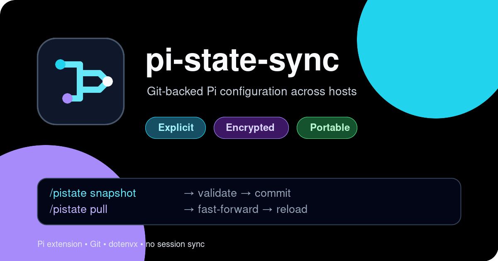

# pi-state-sync

[](https://www.npmjs.com/package/@moejay/pi-state-sync)
[](https://github.com/moejay/pi-state-sync/actions/workflows/ci.yml)
[](https://moejay.github.io/pi-state-sync/)

[](https://moejay.github.io/pi-state-sync/)

Git-backed configuration sync for [Pi](https://pi.dev), with dotenvx validation for encrypted secrets.

`pi-state-sync` adds five explicit commands for configuring, reviewing, committing, pulling, and pushing portable Pi configuration. Sessions, OAuth credentials, trust decisions, caches, and package installations stay local.

## Features

- Choose explicitly between creating a new private GitHub repository, connecting an existing repository, or staying local.
- Configure a dedicated local Git repository and safely reset its remote without deleting local history.
- Generate a state-repository README with new-host clone and daily sync instructions.
- Sync Pi settings, model definitions, context files, extensions, skills, prompts, and themes.
- Commit only an explicit allowlist—never `git add -A` across the whole Pi directory.
- Reject tracked credentials, sessions, package caches, and runtime state.
- Reject likely literal secrets in `settings.json` and `models.json`.
- Validate staged `.env` files with [dotenvx](https://dotenvx.com/docs/quickstart/encryption).
- Use `git pull --ff-only`; never hide conflicts with merges or force pushes.
- Reload Pi after a successful pull.
- Keep all writes user-triggered. No background commits or shutdown-time pushes.
- No session synchronization.

## Install

From npm:

```bash
pi install npm:@moejay/pi-state-sync
```

From GitHub:

```bash
pi install git:github.com/moejay/pi-state-sync
```

Restart Pi or run `/reload` after installation.

## Quick start

Pi stores global configuration in `~/.pi/agent` by default. With [GitHub CLI](https://cli.github.com/) authenticated, run:

```text
/pistate configure
```

The interactive setup:

1. initializes a dedicated Git repository when needed;
2. merges safe host-local paths into `.gitignore`;
3. asks whether to create a new private GitHub repository, connect an existing repository, or stay local;
4. verifies that an existing GitHub repository exists, or confirms creation of a new private one;
5. configures `origin`;
6. generates `README.md` with setup instructions for new hosts when the remote is empty.

You can provide the target directly:

```text
/pistate configure new YOUR_USER/YOUR_PRIVATE_PI_STATE
/pistate configure existing YOUR_USER/YOUR_PRIVATE_PI_STATE
/pistate configure existing git@github.com:YOUR_USER/YOUR_PRIVATE_PI_STATE.git
/pistate configure local
```

Reset only the configured remote while preserving files, commits, and safety ignores:

```text
/pistate configure reset
```

Then snapshot and push:

```text
/pistate snapshot chore: initialize Pi state
/pistate push
```

Without GitHub CLI, `configure` still initializes the local repository and accepts any explicit Git remote URL.

On another host, clone the private state repository where Pi expects its configuration:

```bash
git clone git@github.com:YOUR_USER/YOUR_PRIVATE_PI_STATE.git ~/.pi/agent
pi
```

The committed `settings.json` contains the `@moejay/pi-state-sync` package declaration, so Pi can restore the package. Authenticate separately on each host with `/login`.

If you use a custom config location, set `PI_CODING_AGENT_DIR` before starting Pi. `PI_STATE_DIR` can explicitly select the same Git-backed state root.

## Commands

| Command | Action |
|---|---|
| `/pistate configure` | Choose new, existing, or local repository setup interactively. |
| `/pistate configure new [owner/repo]` | Create and connect a new private GitHub repository. |
| `/pistate configure existing [remote]` | Verify and connect an existing repository. |
| `/pistate configure reset` | Remove only `origin`; preserve local files, commits, and safety ignores. |
| `/pistate status` | Show Git changes without modifying anything. |
| `/pistate snapshot [message]` | Validate, stage allowlisted state, and create a local commit. |
| `/pistate pull` | Require a clean tree, fast-forward pull, validate, then reload Pi. |
| `/pistate push` | Validate state and push existing commits. |

Typical workflow:

```text
/pistate snapshot chore: update Pi config
/pistate push
```

Other host:

```text
/pistate pull
```

`snapshot` does not push. `push` does not commit. This separation keeps network changes explicit.

## What is synchronized

Snapshot allowlist:

- `.env`, `.gitignore`, and the generated state `README.md`
- `settings.json`, `models.json`, and `keybindings.json`
- `AGENTS.md`, `SYSTEM.md`, and `APPEND_SYSTEM.md`
- `extensions/`, `skills/`, `prompts/`, and `themes/`

Always local and rejected if tracked:

- `auth.json`
- `.env.keys`
- `trust.json`
- `models-store.json`
- `sessions/`
- `npm/`, `git/`, `bin/`, and `node_modules/`

## Secrets with dotenvx

OAuth tokens managed by Pi remain in ignored `auth.json`. For static API keys, commit an encrypted `.env` and keep its private key outside Git.

Install the dotenvx CLI for launching Pi with injected values:

```bash
npm install -g @dotenvx/dotenvx
```

Create or update an encrypted value:

```bash
cd ~/.pi/agent
dotenvx set ANTHROPIC_API_KEY "$ANTHROPIC_API_KEY" -f .env
```

This produces:

- `.env` — encrypted values; commit this file.
- `.env.keys` — private decryption key; never commit this file.

Start Pi through dotenvx:

```bash
dotenvx run --strict --env-file ~/.pi/agent/.env -- pi
```

A reusable wrapper is available at [`examples/pix`](./examples/pix).

Custom provider configuration should reference injected variables:

```json
{
  "providers": {
    "my-proxy": {
      "baseUrl": "https://proxy.example.com",
      "api": "anthropic-messages",
      "apiKey": "$MY_PROXY_API_KEY",
      "models": []
    }
  }
}
```

You can keep `.env.keys` locally with mode `0600`, or supply `DOTENV_PRIVATE_KEY` through a password manager. Restart Pi after pulling a changed `.env`; an extension cannot replace its parent process environment.

## Safety model

`pi-state-sync` executes Git and dotenvx with argument arrays rather than shell interpolation. It does not read or display decrypted values.

Before commit or push it checks:

1. State root is its own Git repository, not an accidental parent repository.
2. Forbidden runtime or credential files are not tracked.
3. Likely secret fields in JSON use `$ENV_VAR`, `!secret-command`, or an accepted local placeholder.
4. Only allowlisted Pi paths are staged.
5. dotenvx's pre-commit validation succeeds.

Session transcripts are intentionally excluded because they can contain prompts, source code, command output, images, and secrets.

See [`docs/security.md`](./docs/security.md) for threat model and limitations.

## Conflict behavior

`/pistate pull` refuses dirty working trees and uses `git pull --ff-only`. If hosts diverge:

```bash
cd ~/.pi/agent
git fetch origin
git rebase origin/main
```

Resolve and review conflicts manually, then return to Pi. The extension never force-pushes, stashes, or auto-resolves configuration conflicts.

## Development

```bash
git clone https://github.com/moejay/pi-state-sync.git
cd pi-state-sync
npm install
npm run check
pi -e ./extensions/pi-state/index.ts
```

Preview package contents:

```bash
npm pack --dry-run
```

## Requirements

- Pi with extension and package support
- Git
- GitHub CLI for interactive private-repository creation (optional)
- Node.js 20+
- dotenvx for encrypted environment validation and launch-time injection

## License

MIT
